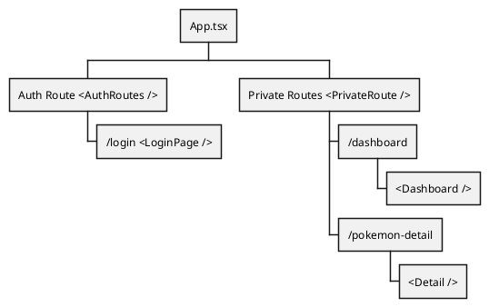

# React JS Skeleton Docs

> Documentation on Progress

## Table of Contents
- [React JS Skeleton Docs](#react-js-skeleton-docs)
  - [Table of Contents](#table-of-contents)
  - [Project Structure](#project-structure)
  - [Routing Tree](#routing-tree)
  - [Installed Library](#installed-library)
  - [Styling 3rd Party Component](#styling-3rd-party-component)
  - [Styling UI Library Component](#styling-ui-library-component)
  - [Utilities Functions](#utilities-functions)
  - [Helper Functions](#helper-functions)
  - [Hooks](#hooks)
      - [Usage](#usage)
      - [Usage](#usage-1)
      - [Usage](#usage-2)


## Project Structure
```
├── docs               # Docs
├── public             # Test files (alternatively `spec` or `tests`)
│    ├── benchmarks    # Load and stress tests
│    ├── integration   # End-to-end, integration tests (alternatively `e2e`)
│    └── unit          # Unit tests
├── src 
│    ├── assets        # Assets files (image/vector/etc..)
│    ├── components    # globally shared components
│    ├── constant      # constant values ex: language config, colors, endpoints
│    ├── helpers       # Helper functions ex: localStorage Handler,query string generator
│    ├── hooks         # Custom hooks
│    ├── interface     # Custom interfaces
│    ├── pages         # Pages Components
│    ├── routes        # Routes Components including auth components
│    ├── stores        # Redux Logic
│    ├── utils         # Utility Functions ex: apiCalls Handler
├── .eslintrc.js       # Eslint configuration, Contact Author For modifying
├── tsconfig.json      # TS configuration Contact Author For modifying

```

> Do not forget to install ESLint Extension if Using VSCode : [Extension Page](https://marketplace.visualstudio.com/items?itemName=dbaeumer.vscode-eslint)


## Routing Tree



> All children inside Private Routes need access token
## Installed Library
-   Styling: Styled Components 
-   State Management: Local state and Redux Toolkit
-   Routing: React Router Dom - V6

## Styling 3rd Party Component

Please use Styled component way to style 3rd party component instead using plain CSS or In-line style
[Styling any component](https://styled-components.com/docs/basics#styling-any-component)

```jsx
// This could be react-router-dom's Link for example
const Link = ({ className, children }) => (
  <a className={className}>
    {children}
  </a>
);

const StyledLink = styled(Link)`
  color: palevioletred;
  font-weight: bold;
`;

render(
  <div>
    <Link>Unstyled, boring Link</Link>
    <br />
    <StyledLink>Styled, exciting Link</StyledLink>
  </div>
);
```

## Styling UI Library Component
- ### Ant Design Component
```javascript
import { Tag } from 'antd';
import Styled from 'styled-components';

type Props = { 
  height?    : string;
  minWidth?  : string;
  cursor?    : string;
}

export const StyledTag = Styled(Tag)<Props>`
  # Style Properties without any css selector 
  # Will be applied directly on to the Component
  # This will rendered equivalent to
  # <Tag style={{}} />
  height           : ${props => props.height ? props.height : '32px'};
  border-radius    : 16px;
  display          : flex;
  align-items      : center;
  min-width        : ${ props => props.minWidth ? props.minWidth :  '150px'};
  padding-left     : 7px;
  
  ${props => props.cursor && `cursor:${props.cursor};`}

  # Style with a selector will be applied on to 
  # Component children
  # in this case will be
  # <Tag> <p> </p> </Tag> 
  # the p tag will be styled with margin-left: 5px;
  p {
    margin-left: 5px;
  }

  .tagging-icon {
    margin-right: 5px;
  }
`;

```
- ### Material UI Component
```jsx=
// component/Button/style.ts
import Button from '@mui/material/Button';
import Styled from 'styled-components';

export const StyledButton = Styled(Button)`
    background-color: #2b2b2b;
    
    :hover{
      background-color: #3b3b3b;
    }
`
```
## Utilities Functions
- ### A
- ### ApiCall Function
    > :bulb: Please use this utilites function to make **ANY** Network request call
   
    | Argument | Type       | Nullable? | Description       |
    | -------- | ---------- | --------- | ----------------- |
    | token    | `string`   | Yes       |  JWT Access Token |
    | baseUrl  | `string`   | Yes       |  Base Url string if not provided it will take base url from `src/config.ts` |
    | endpoint | `string`   | No        |  Endpoint path, example `/products` |
    | header   | `object`   | Yes       |  Request header , example `{ "accessToken" : "Bearer accessTokenString" }` |
    | method   |  `GET` `POST` `DELETE` `PUT` `PATCH`   | No  | Request HTML Method |
    | payload  | `object`   | Yes       |  Request HTML Payload  |


## Helper Functions
- ### History function
    History function used to navigate between routes
    ```javascript
    // src/helpers/history.ts
    const History: CustomHistory = {
      navigate: null,
      push: (page:any, options?:NavigateOptions)  => {
        if (History.navigate) {
          History.navigate(page, options);
        }
      },
    };
    ```
    #### Usage
   ```javascript
    import History from 'helpers/history'
    
    History.push("/dashboard") <- this will push "/dasboard" to history API
   ```    
    > History object will be accessible within the app, even when used outside react life-cycle like in redux actions
## Hooks

- ### useAppDispatch
  A hook to access the redux dispatch function.
  
  #### Usage

```jsx
import React, { useCallback } from 'react'
import { useAppDispatch } from 'hooks'

export const Dashboard = ({ value }) => {
  const dispatch = useAppDispatch()
  const handleGetArticle = useCallback(() => dispatch(getArticles), [])
  return (
    <div>
      <span>{value}</span>
      <button onClick={handleGetArticle}>Increase counter</button>
    </div>
  )
}
```
- ### useTypedSelector
  A hook to access the redux store's. This hook takes a selector function as an argument. The selector is called with the store state.
  
  #### Usage

```jsx
  import React from 'react'
  import { useTypedSelector } from 'hooks'
  
  export const Dashboard = () => {
      const { articles, loading: loadingArticle } = useTypedSelector(state => state.articles);
      return (
          <ul>
            {articles.map}
          </ul>
      )
  }
```
- ### usePrevious
  A hook to access previous value of props or state
  

    | Argument | Type       | Nullable? | Description |
    | -------- | ---------- | --------- | ------- |
    | value    | `any`   | No       |  The state / props that needs to be tracked |
  
  #### Usage
  
```jsx
  import React from 'react'
  import { usePrevious } from 'hooks'
  
  export const Counter = () => {
      const [count, setCount] = useState(0);
      const prevCount = usePrevious(count);
  
      const handleClick = () => {
        setCount(count => count + 1);
      };

      return (
        <div>Current count: {count}, Previous count: {prevCount}
          <button onClick={handleClick}>Increment</button>
        </div>
      )
  }
```
- ### useCountDown
   A custom hook that is used to create a countdown timer. 
   
    | Argument | Type       | Nullable? | Description |
    | -------- | ---------- | --------- | ------- |
    | countdownDate    | `number`   | No       |  The date in milliseconds that you want to countdown |
    
    #### Usage
    
```jsx
  import React from 'react'
  import { useCountDown } from 'hooks'
  
  export const Counter = () => {
      const { hasStopped, valueCountDown, stopCountdown } = useCountdownTimer(100000);
      
      if(hasStopped) {
          return (
            <div>Countdown has stopped</div>
          )
      }

      return (
        <div> Time: { valueCountDown.minutes} : {valueCountDown.seconds}
          <button onClick={stopCountdown}>Stop</button>
        </div>
      )
  }
```